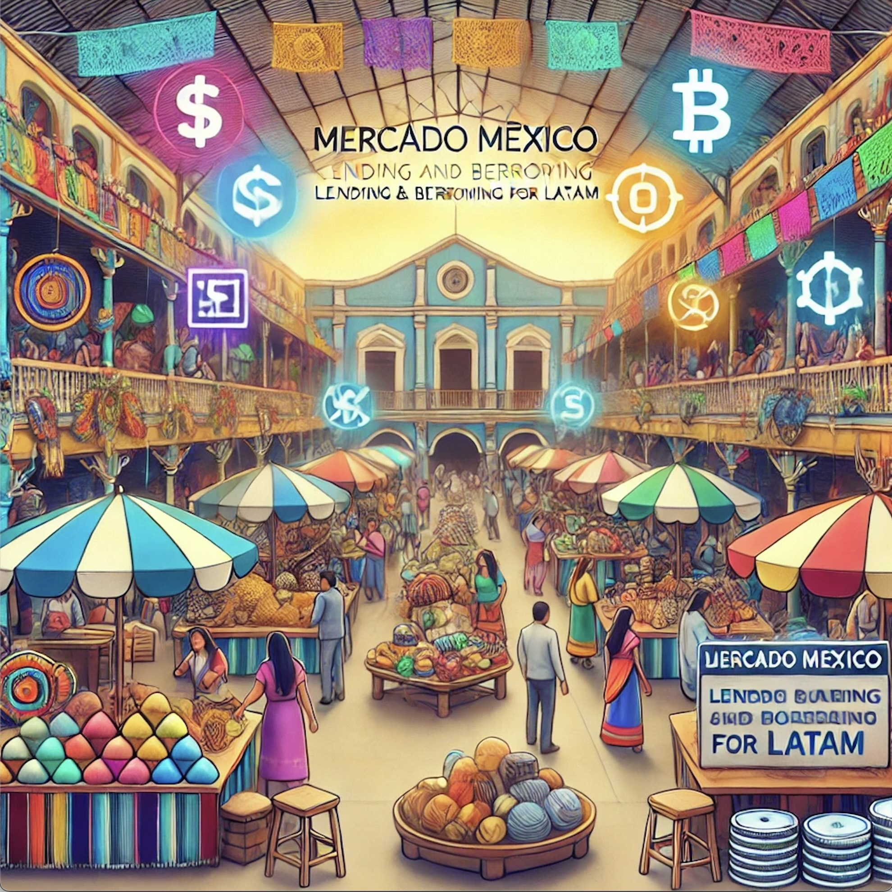

# Mercado Santa Fe 🏦

<div style="text-align: center;">
  
</div>

Lending and borrowing protocol for Fixed-Rate Loans in Mexican Pesos.

## Project Description

**Mercado Santa Fe** is a set of smart contracts deployed on the `Base mainnet` 🔵, designed to serve two key user groups:

1. **Investors**: Generate yield on their [**XOC Tokens**](https://www.xocolatl.finance/), a stablecoin pegged to the Mexican Peso.
2. **Borrowers**: Collateralize USDC to secure fixed-rate loans with repayment plans in Mexican Peso. Borrowers can choose between weekly or monthly repayment schedules, making small, manageable payments over time.

What sets **Mercado Santa Fe** apart from other lending protocols like Aave or Compound is the introduction of fixed interest rates and fixed payment plans. This structure is designed to appeal to borrowers familiar with traditional loan systems, offering predictable payment terms that help align decentralized finance (DeFi) lending with the needs of the average Mexican, and Latam, user.

## Deployed Contracts

Three contracts have been deployed to `Base mainnet`:

- [**USDCToMXNPriceFeed:**](https://basescan.org/address/0x85e2a5B46DB3Dc1E78E3238d7Cd80B3ff5bB0951) A price feed that provides real-time conversion rates between the collateral (USDC) and the Mexican Peso (MXN). This ensures accurate collateral valuation when creating loans.
- [**BodegaDeChocolates:**](https://basescan.org/address/0x9Deb4F3c3C0E343Cf0903598F37B2C13622a0B32) A vault contract managing investor deposits of XOC tokens. It mints shares for investors, tracking their contribution to the vault. These shares can later be redeemed for the original investment plus any interest generated from borrower loans.
- [**MercadoSantaFe:**](https://basescan.org/address/0xd10810E5a0773D417f5DABad107C50420e409689) The core lending contract where borrowers deposit USDC as collateral and set loan terms such as the loan amount, duration, and payment plan. Borrowers benefit from fixed-rate loans with flexible installment options.

## Tokens and Contract Addresses

| Name |        Address (link to BaseScan)          |
| ---- | ------------------------------------------ |
| USDC | [0x833589fcd6edb6e08f4c7c32d4f71b54bda02913](https://basescan.org/address/0x833589fcd6edb6e08f4c7c32d4f71b54bda02913) |
| XOC  | [0xa411c9Aa00E020e4f88Bc19996d29c5B7ADB4ACf](https://basescan.org/address/0xa411c9Aa00E020e4f88Bc19996d29c5B7ADB4ACf) |
| USDCToMXNPriceFeed  | [0x85e2a5B46DB3Dc1E78E3238d7Cd80B3ff5bB0951](https://basescan.org/address/0x85e2a5B46DB3Dc1E78E3238d7Cd80B3ff5bB0951) |
| BodegaDeChocolates  | [0x9Deb4F3c3C0E343Cf0903598F37B2C13622a0B32](https://basescan.org/address/0x9Deb4F3c3C0E343Cf0903598F37B2C13622a0B32) |
| MercadoSantaFe  | [0xd10810E5a0773D417f5DABad107C50420e409689](https://basescan.org/address/0xd10810E5a0773D417f5DABad107C50420e409689) |

## Project Details

The objective of this project is to create an app that allows users to request a fixed-rate loan in Mexican pesos.

Initially, loans will be collateralized using US dollars. This means the user will lock an amount N of dollars, which will grant them an amount X of Mexican pesos, with a fixed interest rate. For example, an 8.00% annual fixed rate.

The user will be able to define a payment plan according to their needs.

If the user does not meet the payment deadlines or does not cover the total amount at the end of the period, the collateral will be liquidated to cover the debt plus penalty fees.

The loans can be used to pay for services such as electricity, water, and gas.

The medium to long-term vision is to automate the loan process to shift the risk to investors who are willing to generate returns, allowing users to obtain microloans without the need for collateralization.

## Key Considerations

- Each loan has it's own individual risk profile.
- Liquidations are great mechanisms to reduce/eliminate the risk of a loan going underwater. But, if we want to allow the entrance of new users to the space, we have to simplify the process and **eliminate** the need for liquidations.

## Future problems to solve

- Using a ERC4626 vault to distribute the collected interest is not very efficient and can be vulnerable to MEV and other kind of liquidity draining.
- Distribute collected interest in a way that actually considers the investor.
- Allow investors to stablish an individual risk profile, and lend their funds only to those kind of loans.

## APY Calculation

One of the most important parameters of the fixed-rate loan is the APY. The value should consider:

- Initial LTV. Less than or around 50% should have low impact. 8% is the max allowed LTV, with the highest APY.
- Loan duration.

## Technologies Used

- **Solidity**: Language for developing smart contracts.
- **Hardhat**: Ethereum development environment that simplifies compiling, testing, and deploying smart contracts.

## Requirements

Make sure you have the following installed:

- Node.js (LTS version recommended)
- npm or yarn
- Hardhat

## Installation

1. Clone the repository:

```bash
git clone https://github.com/josemariasosa/mercado-santa-fe
cd mercado-santa-fe
```

Install the dependencies:

```bash
yarn install
```

## Compile Contracts

To compile the smart contracts, use the following command:

```bash
npx hardhat compile
```

## Run Tests

You can run the tests with this command:

```bash
npx hardhat test
```

## Deploy Contracts

Make sure to configure your network in the `hardhat.config.js` file, and then use the following command to deploy:

```bash
npx hardhat run scripts/mainnet/deploy.js --network base
```

## License

This project is licensed under the MIT License.

## Important links

- Base Oracle USD-MXN: https://basescan.org/address/0x9C2ec31ECeCcD6394Fd0b810d439378805688b3D